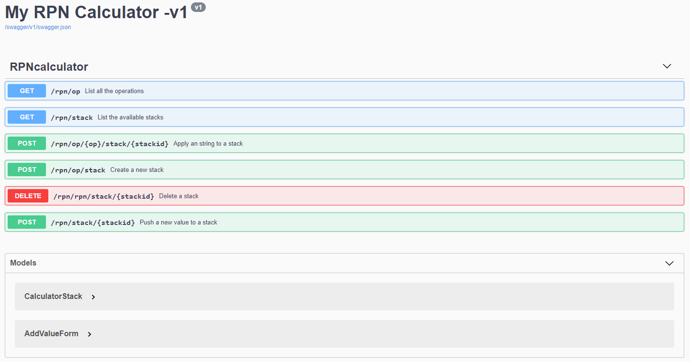

# RPN Calculator #

1. Navigate to the project RPNCalculator.
2. Run the following commands:

    ```
        dotnet restore
        dotnet build
        dotnet run
    ```
3.  Navigate to http://localhost:5000/swagger




4. To run the test run : 
   ```
        dotnet test
    ```